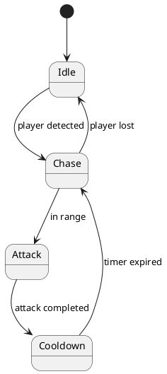

# Finite State Machine

Use a finite state machine when one object has several distinct behaviors with clear transitions, such as an enemy that idles, chases, attacks, and recovers. Do not use one for a simple boolean condition or a short linear action.

## Responsibilities

- The owning instance stores the current state and state-specific timers or data.
- Entry initializes the new state's temporary data.
- Update performs only the current state's behavior.
- Exit releases or resets state-specific data when necessary.
- Transitions state their conditions clearly and occur in one understandable place.

An example state list might be Idle, Chase, Attack, Cooldown, and Disabled. Use only the states the current behavior needs.

## Example

## Testing checklist

- Each state can be entered under its documented condition.
- Entry behavior occurs once per transition.
- Only the current state's update behavior runs.
- Timers reset at the intended time.
- Interrupted states exit cleanly.
- Invalid or missing targets have a safe transition.
- Debug output can identify the current state when needed.
